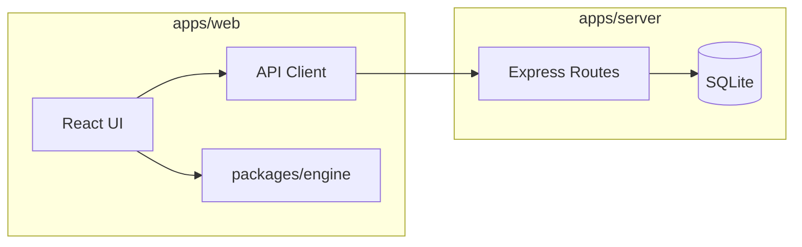

# Architecture

## 1) What Was Built

This pilot implements a local custom chess-variant platform with:

- Login/identity stub (`username` only, local API persistence)
- Main menu:
  - `Hot Seat` (working)
  - `Vs Player` (placeholder)
  - `Vs NPC` (placeholder)
  - `Create` (working basic creator/editor)
- Hot Seat gameplay:
  - Arbitrary board size rendering
  - Piece selection and legal move highlighting
  - Move execution and turn switching
  - Capture handling
  - Capture-the-king game end condition
  - Move history and captured list
- Create mode:
  - Piece type editor (movement/capture patterns, hooks, tags, asset refs)
  - Board editor (id/name/width/height)
  - Setup editor (sides, placements, piece embedding)
- Seeded sample preset with:
  - King (step all 8 directions)
  - Rook-like slider
  - Wiggler piece using custom hook `noRepeatDirection`

## 2) Architecture



- Frontend: Vite + React + TypeScript + React Router
- Backend: Express + better-sqlite3
- Shared schemas/types: `packages/shared`
- Game logic: `packages/engine` (pure, no UI assumptions)

## 3) Data Model

### Piece Type (`PieceTypeDefinition`)

- `id`, `name`, `asset`
- `movementRules[]`, `captureRules[]`
- `constraints` (metadata bag)
- `stateSchema` (optional field hints)
- `defaultState` (initial piece state)
- `tags[]`
- `pieceHooks[]` (extension hooks like `noRepeatDirection`)

### Piece Instance (`PieceInstance`)

- `instanceId`, `typeId`, `side`
- `x`, `y`
- `state` (e.g. `hasMoved`, `lastMoveDirection`, `moveCount`, custom metadata)

### Board Definition (`BoardDefinition`)

- `id`, `name`
- `width`, `height`
- `squareMeta` (optional styling metadata)

### Game Setup (`GameSetup`)

- `id`, `name`, `boardId`
- `placedPieces[]`
- `sides[]`
- `pieceTypes[]` embedded for portability
- `winCondition` (`captureTag: king` in this pilot)

### Game State (`GameState` in engine runtime)

- `currentTurnIndex`
- `pieces` map and `occupancy` map
- `moveHistory[]`
- `capturedPieces[]`
- `status` (`ongoing`/`finished`)
- `winnerSide`

## 4) Rules Engine Design

### Declarative Rule Layer

Movement/capture patterns support:

- `kind`: `step` | `slide` | `jump`
- `vectors[]` (dx, dy)
- optional `range`
- blocker behavior
- `moveOnly` / `captureOnly`
- first-move and unmoved restrictions

### Custom Hook Layer

- Piece-level hook registry in engine (`pieceHookRegistry`)
- Hooks can filter or augment generated moves
- Implemented example:
  - `noRepeatDirection`: prevents a piece from moving in the same normalized direction as its previous move

### Core Engine API

- `generatePseudoLegalMoves(state, pieceId)`
- `validateMove(state, move)`
- `applyMove(state, move)`
- `evaluateWinCondition(state, lastCapture, moverSide)`
- `serializeGame(state)`
- `deserializeGame(data)`

### Internal Representation

- Coordinate-indexed occupancy map for O(1) square lookup
- Piece-id-indexed map for O(1) piece access
- Compact move objects (`from`, `to`, `captureId?`)

## 5) Local Persistence

SQLite tables:

- `users`
- `docs` (generic JSON document store for `piece_type`, `board`, `setup`)

This keeps v1 simple while preserving a migration path to richer schemas later.

## 6) How To Run

```bash
cd ~/chess
rm -rf node_modules package-lock.json packages/*/node_modules apps/*/node_modules
npm install
npm run bootstrap
npm run dev
```

- Web: `http://localhost:5173`
- API health: `http://localhost:3001/api/health`

## 7) API Surface (v1)

- `POST /api/session`
- `GET/PUT/POST/DELETE /api/piece-types`
- `GET/PUT/POST/DELETE /api/boards`
- `GET/PUT/POST/DELETE /api/setups`
- `GET /api/setup-bundle/:id`

## 8) Next Steps

- Online multiplayer
- NPC / AI player
- Invitation/session flow
- Rich form-based rule builder (less raw JSON)
- Setup import/export presets
- Better asset tooling/upload pipeline
