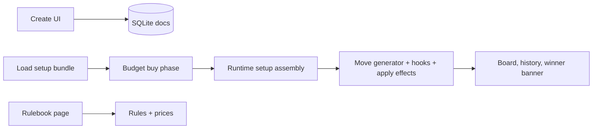

# Architecture

## 1) What Is Implemented

This pilot now includes:

- Local auth stub (username)
- Main menu + routed pages
- Hot Seat local play
- Pre-game budget buy phase
- Rulebook page
- Create endpoints (`/create/piece`, `/create/board`)
- Piece/board/setup persistence in SQLite docs store
- Sound effects hooks in gameplay UI

## 2) High-Level Flow



## 3) Data Model Extensions

### `PieceTypeDefinition`

Extended with:

- `price: number` (default 1)
- `displayRepresentation?: string`
- `behavior?: { ... }`:
  - `slipProbability`
  - `attentionRadius`
  - `attentionIdleLimit`
  - `skinnerForceRepeat`
  - `stageSequence`

### `GameSetup`

Extended with:

- `budgetMode?: { enabled: boolean; startingBudget: number }`

### Runtime `GameState`

Extended with:

- `turnNumber`

## 4) Engine Rule Architecture

### Declarative Layer

Patterns still drive baseline movement:

- `kind`: `step | slide | jump`
- vectors, range, blockers
- capture/move-only constraints
- first-move restrictions
- side-relative vectors

### Hook Layer

Piece hooks post-process generated pseudo-legal moves.

Implemented hooks:

- `castleLike`
- `noRepeatDirection`
- `hegelDialectic`
- `nietzscheStatic`
- `vygotskyEvolution`
- `skinnerReinforce`
- `attentionSpanLocal`
- `freudSlip` (apply-time reroute)

### Apply-Time Effects in `applyMove`

- Optional Freud slip reroute before final move application
- Hegel direction class memory update
- Skinner reward-repeat state update
- Vygotsky stage progression after captures
- Attention Span idle-turn increment and despawn
- Companion move support (castling)

## 5) Piece Behavior Summary

- **Hegel**: queen-like movement, cannot repeat same direction class back-to-back
- **Nietzsche**: cannot move and cannot be captured
- **Vygotsky**: starts pawn-like, upgrades through configured stage sequence on captures
- **Skinner**: after a capture, must repeat previous vector next move if legal
- **Freud**: configured chance that intended move is replaced by random legal move
- **Attention Span**: local radius movement, removed after too many idle owner turns
- **Placebo**: bishop-like real rules with optional stronger visual representation
- **Causal Loop**: intentionally left as future extension point

## 6) Budget Mode Runtime

1. Load selected setup + board.
2. If `budgetMode.enabled`, show buy UI for both sides.
3. Enforce per-side budget by piece `price`.
4. Build runtime setup from purchased quantities.
5. Auto-place kings and fill remaining purchased pieces on each side's home half.
6. Start normal Hot Seat play.

## 7) Seeded Defaults

Server seed includes normal + custom catalog with relative prices and behavior metadata. Existing docs are upserted by id, so updates remain idempotent.

## 8) Testing

Engine tests cover:

- Existing functionality (serialization, castling, capture win)
- All implemented new custom piece behaviors

## 9) Run / Build

```bash
cd ~/chess
npm install
npm run bootstrap
npm run test
npm run build
npm run dev
```
